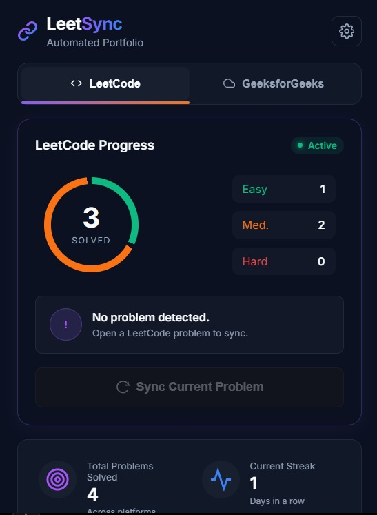
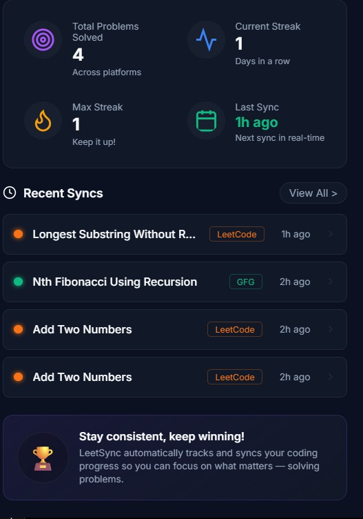
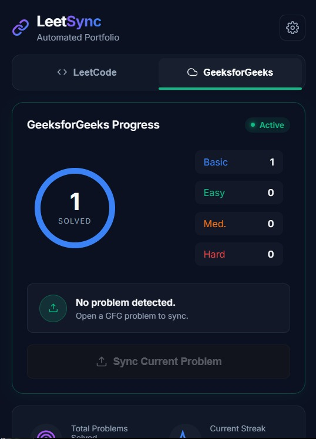
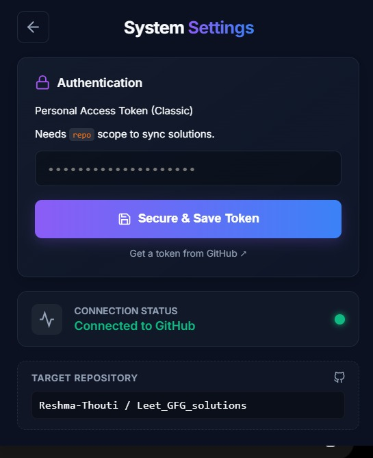
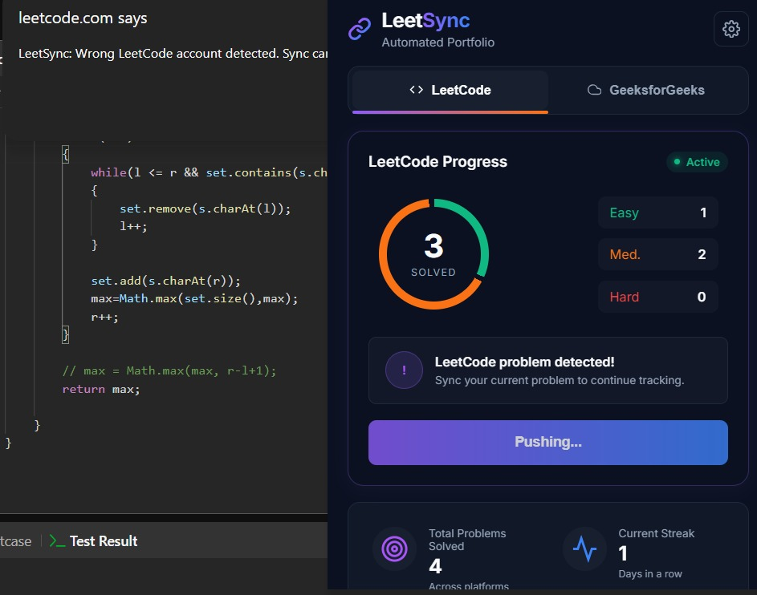
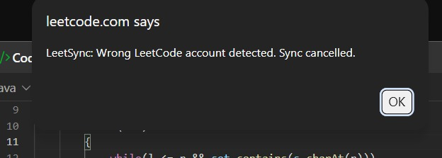
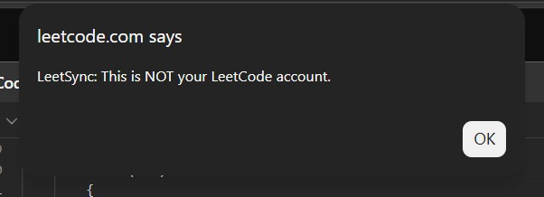

<div align="center">


# ⚡ LeetSync — Automated Coding Portfolio Sync

> Automatically push your accepted LeetCode and GeeksforGeeks solutions to GitHub — complete with READMEs, difficulty badges, language folders, and live stats — the moment you hit "Submit."


</div>

---

## ✨ Features

- **Auto-Sync on Accept** — Detects a successful submission and immediately pushes your solution to GitHub without any manual steps.
- **Account-Locked Sync** — Only authorized LeetCode and GeeksforGeeks usernames can sync solutions, preventing accidental uploads from shared browsers or friend accounts.
- **Accepted-Only Upload Logic** — Solutions are pushed to GitHub only after an **Accepted / Problem Solved Successfully** result. Wrong answers, compile errors, and failed submissions are ignored.
- **Multi-Platform Support** — Works seamlessly on both [LeetCode](https://leetcode.com) and [GeeksforGeeks](https://www.geeksforgeeks.org).
- **Multi-Language Support** — Correctly identifies and organizes solutions in Java, Python, C++, JavaScript, and more.
- **Smart Folder Structure** — Organizes files by `Platform → Language → Difficulty → Problem Title` automatically.
- **Per-Problem README** — Each solution gets its own auto-generated `README.md` with the problem link, difficulty badge, tags, runtime, and memory stats.
- **Live Master Dashboard** — A top-level `README.md` per language is regenerated after every sync, showing Easy / Medium / Hard counts as live shield.io badges.
- **Animated Donut Charts** — The popup renders a live conic-gradient donut chart per platform, broken down by difficulty, built dynamically from your GitHub repo tree.
- **Per-Platform Tabbed Dashboard** — A segmented LeetCode / GeeksforGeeks tab control auto-switches to the correct platform when you open the popup on a problem page.
- **GFG Basic/School Tracking** — GeeksforGeeks "Basic" and "School" difficulty problems are correctly counted separately from "Easy" and displayed in cyan on the chart.
- **Force Sync Button** — Manually trigger a sync for any open problem directly from the popup, with live button state feedback ("Pushing...").
- **Cache-Busting Uploads** — Uses `cache: 'no-store'` and SHA-aware PUT requests so updates never silently fail due to stale browser cache.
- **Session-Aware Auto-Sync** — Detects previously solved problems on page load and auto-syncs once per session via `sessionStorage`, preventing redundant API calls on refresh.
- **Streak Tracking** — Tracks your current and all-time best solving streaks with a timezone-safe algorithm, displayed in the popup dashboard.
- **Recent Syncs Feed** — The last 5 synced problems are stored locally and displayed as clickable links directly to their GitHub folder, color-coded by difficulty with relative timestamps (e.g. "2m ago").

---

## 🖥️ Popup UI (v1.1)

The popup was fully redesigned in v1.1 with a premium dark navy theme.

| Element | Detail |
|---|---|
| Theme | Premium dark navy (`#0B1121` background, purple-to-blue gradient accents) |
| Size | Fixed 440px wide, scrollable, overflow hidden to prevent scrollbar jitter |
| Dashboard | Segmented tab control (LeetCode / GeeksforGeeks) with platform-specific color tinting |
| Chart | Animated conic-gradient donut with gap separators; collapses to a solid ring for single-difficulty repos |
| Difficulty pills | Easy (green), Medium (orange), Hard (red), Basic/School (cyan) |
| Global Stats Grid | 2×2 card grid showing Total Solved, Current Streak, Max Streak, and Last Sync time |
| Settings | Slide-in view with GitHub token input and live connection status dot |
| Toast | Fixed bottom-center slide-up notification for success / error feedback |

---

## 🛠 Tech Stack

| Layer | Technology |
|---|---|
| Extension Platform | Chrome Extensions (Manifest V3) |
| Language | Vanilla JavaScript (ES2020+) |
| Storage | `chrome.storage.local` API |
| GitHub Integration | GitHub REST API v3 — Contents & Git Trees endpoints |
| UI | HTML5, CSS3 (CSS Variables, conic-gradient, Keyframe Animations) |
| Fonts | Inter (Google Fonts) |

---

## 🚀 Getting Started

### Prerequisites

- Google Chrome (or any Chromium-based browser)
- A [GitHub Personal Access Token](https://github.com/settings/tokens) with **`repo`** scope enabled
- A GitHub repository to push solutions into (public or private)

### Installation

LeetSync is loaded as an **unpacked extension** — no Web Store required.

1. **Clone the repository**
   ```bash
   git clone https://github.com/Reshma-Thouti/LeetSync-Extension.git
   cd LeetSync
   ```

2. **Open Chrome Extensions**

   Navigate to `chrome://extensions` in your browser.

3. **Enable Developer Mode**

   Toggle the **Developer mode** switch in the top-right corner.

4. **Load the Extension**

   Click **"Load unpacked"** and select the cloned `LeetSync` folder.

5. **Configure Your Repository**

   Open `background.js` and `popup.js` and update the two constants at the top of each file:
   ```js
   const REPO_OWNER = "your-github-username";
   const REPO_NAME  = "your-repo-name";
   ```

6. **Add Your GitHub Token**

   Click the LeetSync icon in your toolbar → ⚙️ Settings → paste your GitHub Personal Access Token → **Save Token**.

   The token is stored locally via `chrome.storage.local` and never transmitted anywhere except the GitHub API.

---

## 📖 Usage

Once installed and configured, LeetSync runs automatically in the background.

### Automatic Sync
1. Navigate to any problem on LeetCode or GeeksforGeeks.
2. Write your solution and click **Submit**.
3. When the "Accepted" / "Problem Solved Successfully" result appears, LeetSync detects it and pushes your solution to GitHub within seconds — no action needed.

### Manual / Force Sync
If auto-detection misses a submission (e.g., on a slow connection or after a page refresh):
1. Click the **LeetSync** extension icon.
2. Click **"Sync Current Problem"**.

The button activates automatically and tints itself with a purple-blue gradient (LeetCode) or green (GFG) based on the current page.

### Checking Your Stats
Open the popup on any page to see:
- **Donut chart** — total solved and per-difficulty breakdown, rendered live from your GitHub repo tree.
- **Tab switching** — toggle between LeetCode and GFG dashboards; the correct tab is pre-selected when you're on a problem page.
- **Global Stats Grid** — total problems solved, current streak, max streak, and last sync time at a glance.
- **Recent Syncs** — the last 5 problems synced, with difficulty dots, platform badges, and direct GitHub links.

---

## 📁 Project Structure

```
LeetSync/
│
├── manifest.json       # Extension config (MV3): permissions, host rules, content script routing
├── background.js       # Service worker: GitHub API uploads, SHA resolution, master README generation, streak algorithm
├── content.js          # LeetCode content script: MutationObserver, multi-strategy data extraction
├── content_gfg.js      # GFG content script: MutationObserver, Monaco + Ace editor support
├── popup.html          # Popup markup: tabbed dashboard, donut charts, global stats, settings view
├── popup.css           # Premium dark navy theme, conic-gradient chart styles, tab control, gamification banner
├── popup.js            # Popup logic: tab switching, donut engine, GitHub tree parser, force sync, streak display
└── Icon.png            # Extension icon (16 / 48 / 128 px)
```

### Generated Repository Structure (in your GitHub repo)

```
your-repo/
├── LeetCode/
│   └── Java/
│       ├── README.md                   ← Master dashboard (auto-regenerated on every sync)
│       ├── Easy/
│       │   └── Two Sum/
│       │       ├── Solution.java
│       │       └── README.md           ← Per-problem README with badges, tags & description
│       ├── Medium/
│       │   └── ...
│       └── Hard/
│           └── ...
└── GeeksforGeeks/
    └── Python/
        ├── README.md
        ├── Basic/
        ├── Easy/
        ├── Medium/
        └── Hard/
```

---

## 🤝 Contributing

Contributions are welcome! Ideas for extension include:

- Adding support for additional platforms (Codeforces, CodeChef, HackerRank)
- Per-language breakdown within the donut chart
- Dark/light theme toggle in the popup
- Calendar heatmap for streak visualization

To contribute:
1. **Fork** the repository.
2. **Create** a feature branch: `git checkout -b feature/your-feature-name`
3. **Commit** your changes: `git commit -m 'feat: add Codeforces support'`
4. **Push** to your branch: `git push origin feature/your-feature-name`
5. **Open a Pull Request** — describe what you changed and why.

Bug reports and feature requests via [Issues](../../issues) are also very welcome.

---

## 🔐 Custom Enhancements

This version includes additional personalization improvements beyond the base implementation:

- **Account-Locked Sync**  
  Syncing is restricted to authorized LeetCode and GeeksforGeeks usernames.

- **Accepted-Only Upload Protection**  
  GitHub uploads occur only after successful accepted submissions.

- **Friend / Shared Browser Safety**  
  Prevents accidental solution uploads from other logged-in accounts.

- **Personal GitHub Repository Integration**  
  Configured to upload solutions into a dedicated personal coding portfolio repository.

---

## 📷 Screenshots
   ### Dashboard

   
   
   
   
   ### Settings Panel

   

   ### GitHub Auto Sync

   

   ### Account Protection

   
   
   

---

## ⚠️ Known Limitations

- **LeetCode UI Changes** — LeetCode occasionally updates its DOM class names. If auto-sync stops working, use **Force Sync** and open an issue with the browser console output.
- **GFG Dual Editor** — GeeksforGeeks uses both Monaco (`.view-line`) and Ace (`.ace_line`) editors depending on the problem. Both are handled, but edge cases may exist.
- **GitHub API Rate Limits** — With a valid token the limit is 5,000 requests/hour, sufficient for normal use. Without a token, the limit drops to 60/hour and the extension will not function.
- **Branch Assumption** — The popup hardcodes `BRANCH = "main"`. The background service worker dynamically fetches the default branch via the repo API, but if your default branch differs (e.g. `master`), update the `BRANCH` constant in `popup.js` to match.

---

## 📄 License

This project is licensed under the **MIT License** — you are free to use, modify, and distribute it.

---

<div align="center">
  <sub>Built with ❤️ by <a href="https://github.com/Reshma-Thouti">Reshma-Thouti</a> — because your solutions deserve to be seen.</sub>
</div>
